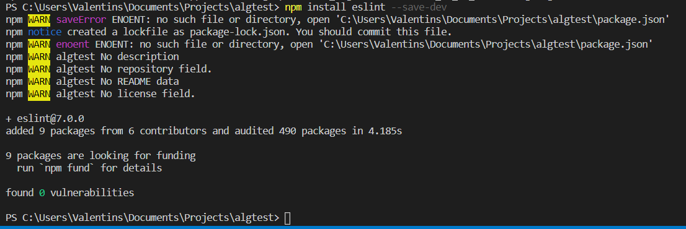
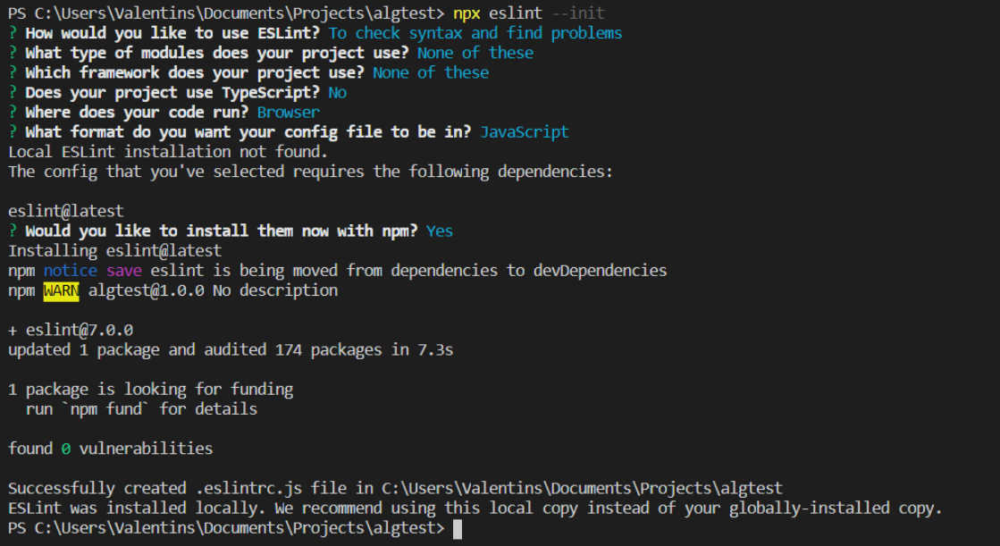
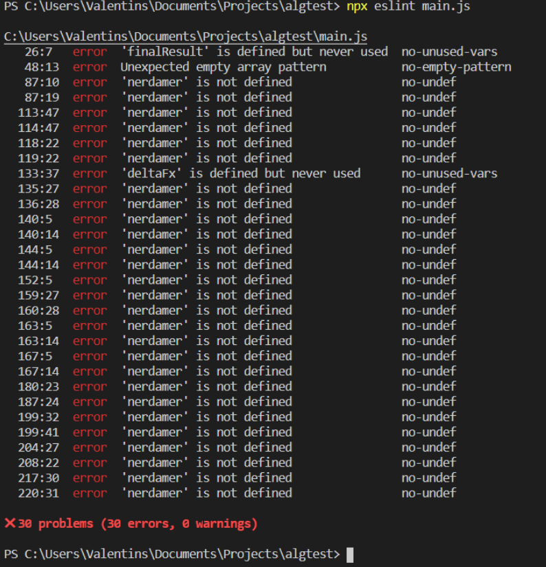
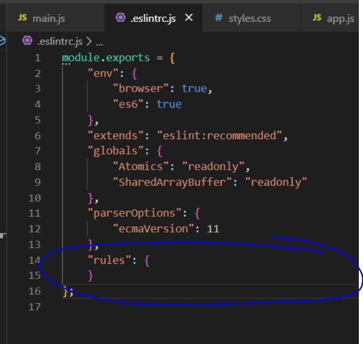
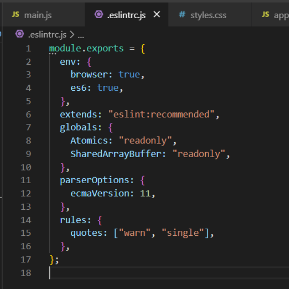

# Module 4 homework dev version

## Link to .js file against which eslint was ran - https://github.com/vjegorovs/nlp-optimization/blob/master/main.js

## Steps:

### Intall ESLint with npm:

- 

### Quick setup eslint with npx eslint --init:

- 

### Run eslint against target js file with npx eslint jsfilename.js:

- 

#### Analysis - 'nerdamer' errors because I load a script in html not npm/es6 module, others are valid bugs to fix :D

## Changing config rules

### Default config:

- 

### Added a custom rule:

- 

### New result with the new added warnings:

- 
