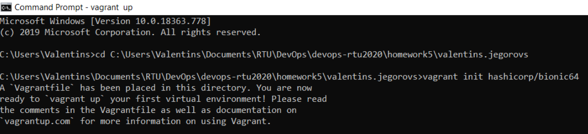
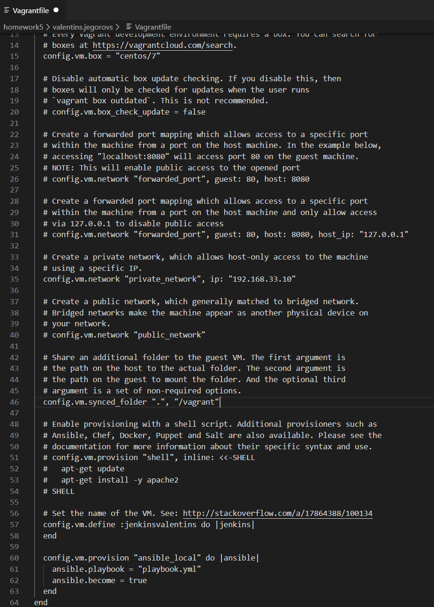
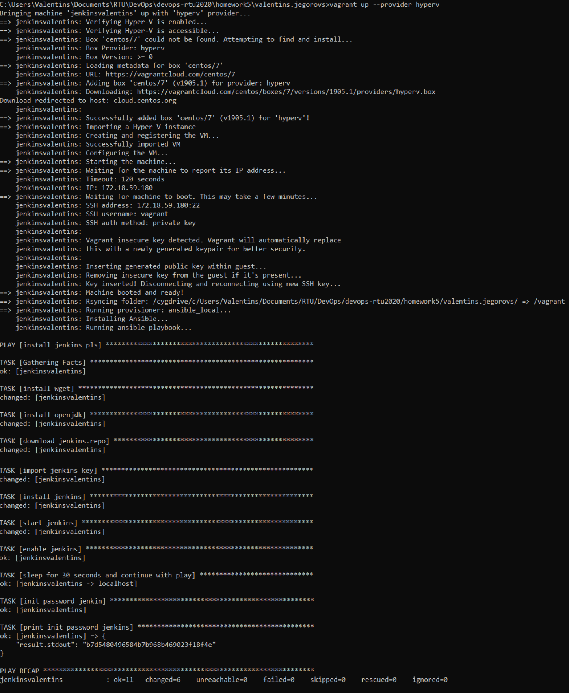
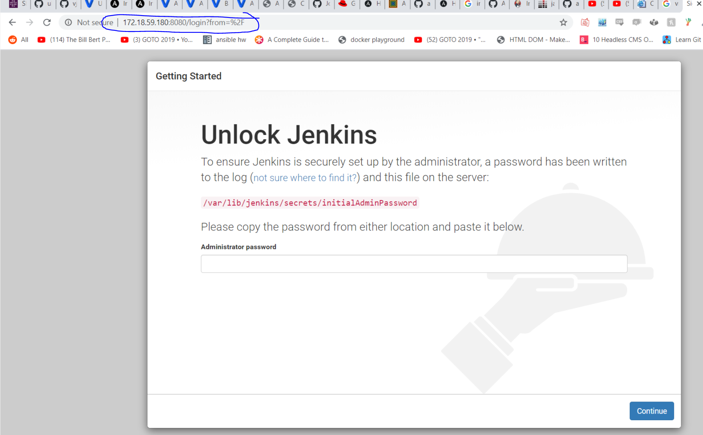
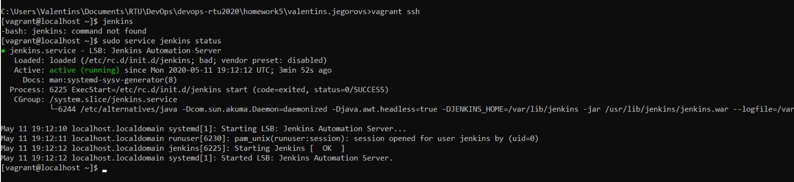
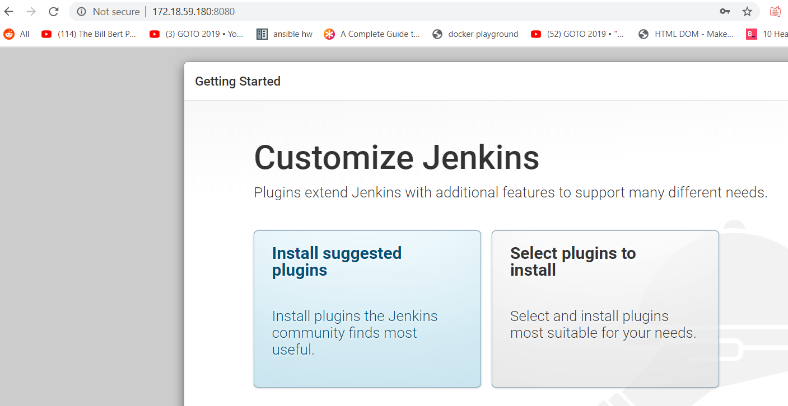
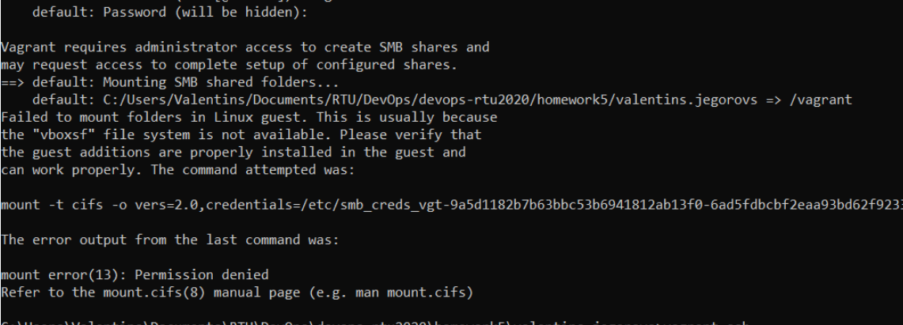
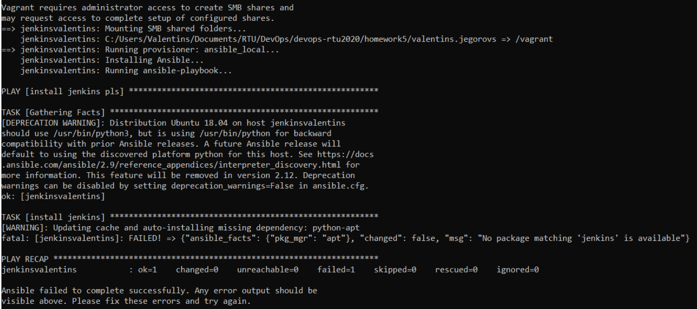

# Module 5 homework devOps version

## Directory includes:

- Vagrantfile

- playbook for Ansible

- Vagrant commands screenshots with results

## Easy launch options:

1. clone repo
2. cd to valentins.jegorovs folder
3. vagrant up --provider hyperv (or any other hypervisor you have)

## Steps:

### Navigate to project folder and vagrant init:

### Change Vagrantfile condfigs with appropriate. I've tried for 2hrs to get it working on ubuntu, but then in desperation switched to centos and all worked, most necessary settings are config.vm.box to select guest os, config.vm.synced_folder must be set to `".", "/vagrant"` because we are running ansible_local on guest only, and config.vm.privision to launch local ansible. config.vm.define is just to rename vagrant vn name.

### Write a playbook file for local Ansible, with the commands youd like to run on guest vm. I've went with local version of vagrant ansible for provisioning, because my host machine is windows and ansible for windows is tricky and tiresome to install. In Vagratgile vm.provision part denote name of the playbook. This specific playbook I've found commands online, since apparently installing jenkins on linux is not an easy thing to do(or so I thought). Basically contains wget, openjdk, jenkins and then also launches jenkins and echos initial admin password for setup:

### Launch Vagrant vm with vagrant up and optional flag --provider hyperv due to me running hyperv:

As can be observed everything worked out\*

\*after hours of yelling

### Access jenkins from ip listed in cmd when vagrant was booting up and 8080 port:

### Use vagrant ssh to ssh into your vm and play around:

### Remember about that password stdout in your playbook and use it to continue with the Jenkins setup:

#### Postword and most frustrating problems:

- Apparently not having a password on your Windows account is a sin and without setting a password you will not get past the smb boss during the vagrant up phase:

- Trying to install openjdk on ubuntu is impossible no matter what I've tried specifying in the playbook. Switching to centos as the box solved all the problems..

- After making it work it was quite enjoayable to get the end desired result. Although my linux and playbook writings skills are non-existend I've found out :)
