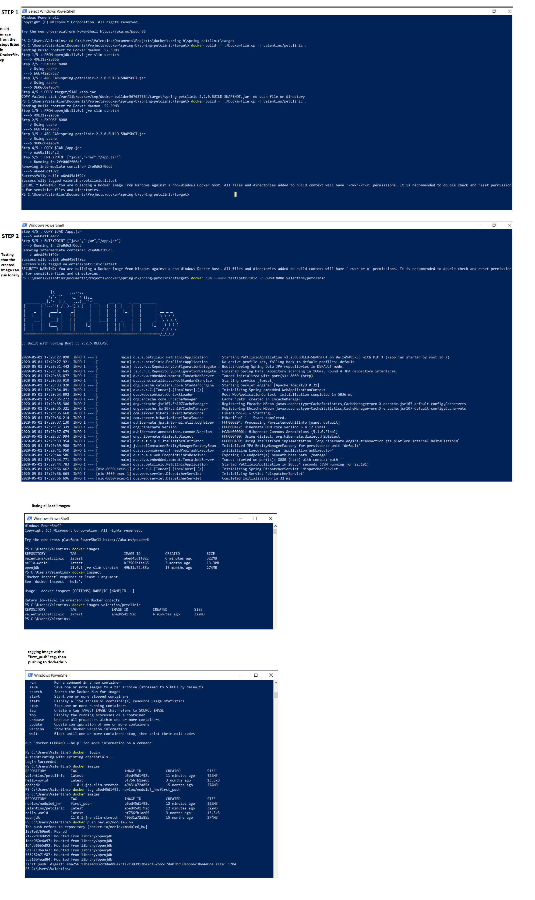

# Module 6 homeword dev version

## Directory includes:

### - compiled .JAR file for spring/petclinic, which was compiled locally using the steps listed in the respective github repo

### - Dockerfile

### - Docker commands screenshots with results

## Easy launch options from dockerhub:

1. docker pull nerlex/module6_hw:first_push

#### Steps were: compile .jar locally, write dockerfile commands, build image using the dockerfile, test if it works, also upload to dockerhub

